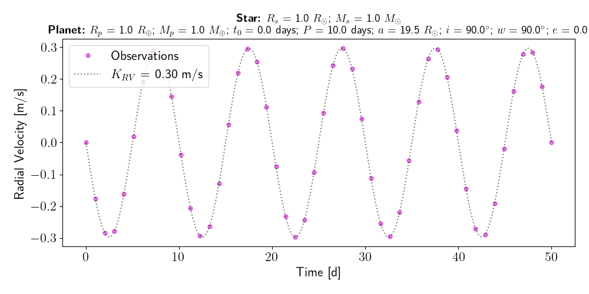
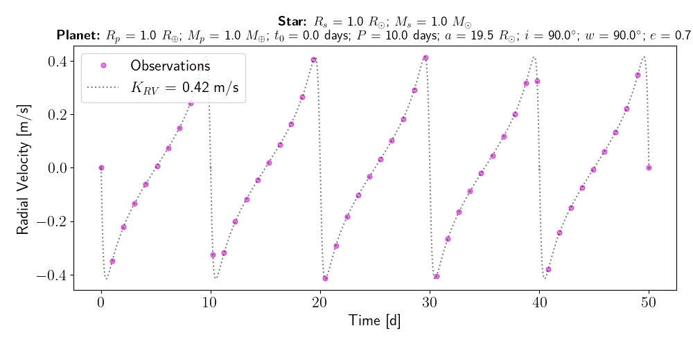

Tutorial
========

At the root of the MARVELsim repository two scripts called ``marvelsim.py`` and ``rv-generator.py`` are made availble for the user in the ``marvelsim/`` directory. The former is the main script we will use to simulate the MARVEL spectra. We will in the following distinguish between the usage of the **frame/debug mode**, **calibration mode**, and **science mode** of this software. To acquire an overview of the usage simply type:

.. code-block:: shell

   python marvelsim.py -h

Intuitively the science mode should be used when simulating a Radial Velocity (RV) time series for which a cross-dispersion displacement in the simulated spectra is generated by the presence of an exoplanet orbiting its stellar host. We will ellaborate on how to perform such simulations in the following, but notice that the ``rv-generator.py`` is a small generic script to generate the RV time series as input for ``marvelsim.py``. The calibration mode of ``marvelsim.py`` is also known as *afternoon calibrations* as these calibrated spectral images are usually conducted during the afternoon prior to the nightly observations. If you are a new user we recommend you to first try the **frame mode**.

.. seealso::
   
   For more explicit examples on how to use either PyEchelle and Pyxel independently, have a look at the section :ref:`extra examples <extra examples>`.

   

.. raw:: html

   

.. _tutorial_frame:

Frame mode
----------

Before running the calibration and science modes of the simulator, it is suggested to use the **frame mode**. As the name indicates this mode creates a single frame of a custom spectrum, i.e. with custom source injection of the five channels. What light source that is injected into determined by the capital letter of a 5-character name. The options are the following:

- ``B``: Bias (white noise only)
- ``D``: Dark (white noise and dark current)
- ``F``: Spectral flat-field (uniform source)
- ``T``: ThAr arc
- ``E``: Fabry-Perot etalon
- ``S``: Science stellar spectrum

For an example to generate a spectral arc using the ThAr lamp for all fibers would be:

.. code-block:: shell
		
   python marvelsim.py --frame TTTTT -o </path/to/output>

Note that the naming of the output files are similarly saved into a folder of the 5-character naming convention (i.e. ``<XXXXX>`` with X being any of the above data products) at the output location ``<path/to/output>``. 

.. admonition:: Note

   Similarly to the frame mode, to debug issues we provide a **debug mode**. Simply replacing ``--frame`` with ``--debug``, this mode works identically to the frame mode, however, in debug mode, the spectrum from PyEchelle is also saved. This can be very handy to check if an issue is related to PyEchelle or Pyxel.
   

		
   
.. raw:: html

   

   
.. _tutorial_calibration:
   
Calibration mode
----------------

The script ``marvelsim.py`` makes it very easy to produce a batch of calibration data similar to what in the future will be produced in the afternoon, so-called afternoon calibrations. A batch of calibrated data consist of:

  * 10 bias images
  * 10 dark images
  * 5 spectral flats (fiber 1-5)
  * 5 ThAr arc spectra (fiber 1-5)
  * 5 Etalon (fiber 1) + ThAr (fiber 2-5)

The calibrated data are simply generated by adding the calibration flag and parsing the output directory to the simulator: 

.. code-block:: shell

   python marvelsim.py --calibs -o </path/to/output>

As seen in the help-function printed to bash, you can easily alter the number of exposures and exposure time for each type of calibrated data. 

.. raw:: html

   

.. _tutorial_science:
   
Science mode
------------

Like the calibration mode of ``marvelsim.py``, the science mode is likewise very user frindly. In the following we show two usage examples for simulating a single spectrum of a Sun-like star, with and without a RV signal:

.. code-block:: shell

   python marvelsim.py --science --time 300 --mag 10.0 --teff 5800 --logg 4.5 --z 0.0 --alpha 0.0 -o </path/to/outdir>
   python marvelsim.py --science --time 300 --mag 10.0 --teff 5800 --logg 4.5 --z 0.0 --alpha 0.0 --rv 50 -o </path/to/outdir> 

Typically you want to simulate a larger batch of simulations comprising a RV time series of spectra. In the following we explain how to generate such a RV time series as input for ``marvelsim.py`` and later how you can :doc:`lunch simulations with parallel computing <performance>`.

.. raw:: html

   

   
.. _tutorial_rv_script:

RV time series
--------------
   
Within the ``marvelsim/`` directory a script to generate noise-less RV amplitude time series exists. Again to get an overview of the parsed arguments simply type:

.. code-block:: shell

   python rv-generator.py -h

This small utility explores the python library `RadVel <https://radvel.readthedocs.io/en/latest/>`_ for calculating the true anomaly for a given set of input time point over the observed duration. The modelling of the RV time series are then calculated using the expression for the observed RV signal (Eq. 65) given by `Murray & Correria (2010) <https://arxiv.org/pdf/1009.1738.pdf>`_. Seen in the figure below, we here show an example of generating the RV time series for a single Earth-like planet with a short circular and eccentric orbital period, respectively:  

.. code-block:: shell

   python rv-generator.py -tdur 50 -rs 1 -ms 1 -rp 1 -mp 1 -t0 0 -p 10 -i 90 -w 90 -e 0.0
   python rv-generator.py -tdur 50 -rs 1 -ms 1 -rp 1 -mp 1 -t0 0 -p 10 -i 90 -w 90 -e 0.5

	   
The script can also create models of multi-planet systems. As an example we here show how to model the K6V spectral type star `TOI-1260 <https://academic.oup.com/mnras/article-abstract/505/4/4684/6280967>`_ hosting two (transiting) mini-Neptunes on (assumed) circular orbits:

.. code-block:: shell

   python rv-generator.py -tdur 50 -rs 0.67 -ms 0.69 -rp 2.33 2.82 -mp 8.6 11.8 -t0 10 20 -p 3.13 7.49 -i 90 90 -w 0 90 -e 0 0

.. image:: figures/rv_model_multiple.png
   :align: center
   :width: 800

.. admonition:: Note

   Notice that the current version of ``rv-generator.py`` simply schedule an observation for each consecutive night separted exactly one day apart. In the future it will be possible to select the observational compaign through tighter constraints.
	   
.. attention::

   Be warned that the current multi-planet model is very simplistic and do not take into account of the gravitational interactions between the planets. Indeed such interactions perturbes the reflex motion of the stellar host.
